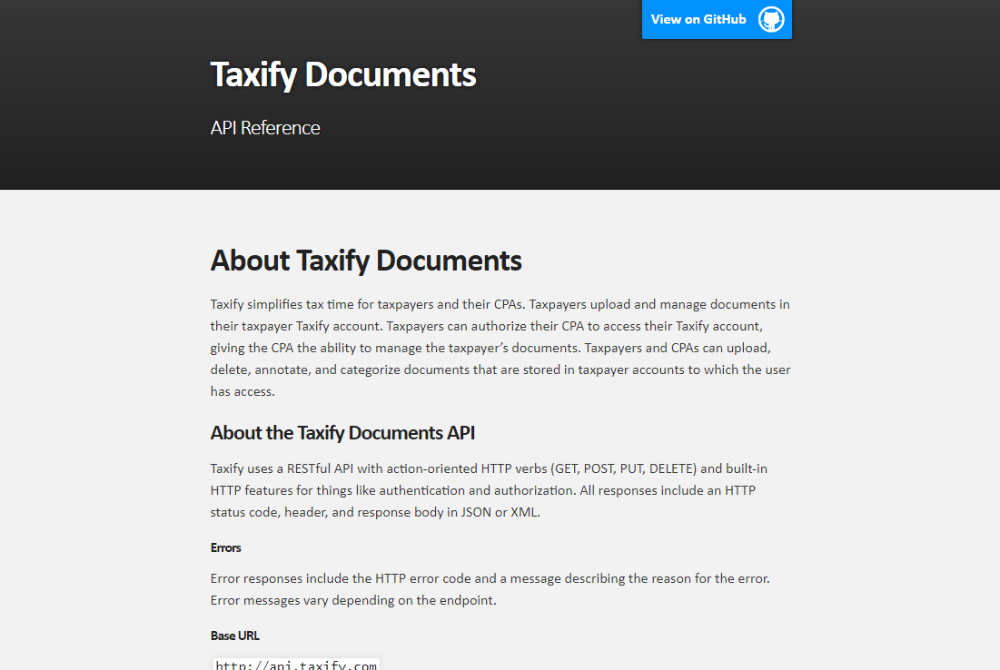

# Taxify API Docs

This html [API reference](https://mollieswenson.github.io/taxify-api-docs/) includes a name, description method, url, parameters (with parameter name, type, required, and description), sample cURL request, and sample JSON response for each Taxify API endpoint. It’s written in Markdown and published using GitHub Pages.

